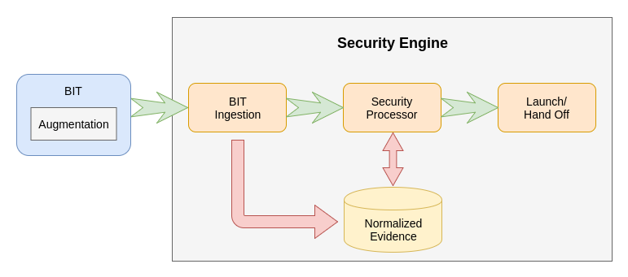

# General Architecture

The general execution flow for TrenchBoot is broken into three phases,
Bootstrap, Intermediate, and Runtime. The Bootstrap phase primarily
consists of the existing bootstrap technology, e.g. UEFI, grub, UEFI
shim, etc. For TrenchBoot the bootstrap technologies that have an
integrity function, referred to as a Boot Integrity Technology (BIT),
are of primary interest. The Intermediate phase is that which the
TrenchBoot Loader executes to establish the launch integrity of the
system. The last phase is the Runtime phase and is where the target
runtime, hypervisor, operating system, etc, is given control over the
system.

# TrenchBoot Security Engine

At the heart of the TrenchBoot Loader is the TrenchBoot Security
Engine. The Security Engine is responsible for processing any evidence
collected by the BITs, collecting new evidence as needed, evaluating
all evidence according to a security policy, and executing appropriate
enforcement actions. The components that enable this and their
relationship can be seen in the top level diagram below.

## Evidence

A core concept in TrenchBoot is that of evidence. For TrenchBoot,
evidence is a record of an event that occurred within the system. The
typical form for these records is a cryptographic hash of the system
state that was the result of this event. This cryptographic hash is
often referred to as a measurement.

## Boot Integrity Technology

Boot Integrity Technologies (BITs) are software or hardware
capabilities that are responsible for a portion of system launch.
Specifically these capabilities attempt to establish and/or enforce a
degree of integrity that the correct logic was used to launch the
system.

## BIT Augmentation

There may be BITs that need to be directly or indirectly extended to
enable or enhance their usage for launching a TrenchBoot environment.

## BIT Ingestion

A TrenchBoot Security Engine must be capable of supporting a variety
of evidence formats for the various BITs supported. Translation of
these various formats allows TrenchBoot to maintain normalized data
structures for evidence collected. This allows the functionality in
Security Processor to only have to reason about normalized data
without specialized logic for different data formats.

## Security Processor

At the heart of a TrenchBoot Security Engine is the Security
Processor. The Security Processor consist of the logical components
that will consume a launch policy and take one or more actions to
evaluate the state of the system necessary to enforce the policy. This
may include, but is not limited to, collecting additional evidence,
making attestation assertions, retrieving encryption keys, and
file/block/drive decryption. The enforcement of the security policy
will result in a full, partial, or failed boot of the system.

## Launch/Hand Off

Ultimately TrenchBoot's responsibility is to launch a target
environment. As such it must be equipped with the various ways
required to launch those target environments.
